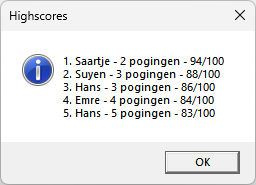

# Mastermind - PE 3

Het spel is ondertussen volledig getest door het test-team en goed bevonden, maar de klant wil nog een laatste reeks wijzigingen doorvoeren.

**Spelverloop:**

- Pas het menu aan zodat er een nieuw menu-item "Spel" is met daaronder de opties "Highscores", "Hint" en "Betalingen". De optie "Highscores" verdwijnt van de "Bestand" menu.
- Omdat er nu met meerdere spelers kan gespeeld worden moet het eindklassement getoond worden wanneer de laatste speler gespeeld heeft.
- Pas de highscores aan zodat enkel de eindwinnaar geregistreerd wordt wanneer er met meerdere spelers gespeeld wordt.
- Sorteer de highscores van hoogste puntenaantal naar laagste.

### Functionele vereisten

| ID | Onderwerp | Beschrijving |
| :--- | :--- | :--- |
| Mastermind-PE3-01 | Menu aanpassing | Het volledige menu moet er als volgt uitzien:   |
| Mastermind-PE3-02 | Eindklassement | Wanneer het spel van de laatste speler beëindigd is, moet er een eindklassement getoond worden. Dit moet getoond worden met een berichtvenster zoals hieronder getoond. Let op, dit mag enkel getoond worden als er met meerdere spelers gespeeld wordt!     Als er niet met meerdere spelers gespeeld wordt, dan wordt de standaard info getoond.      | 
| Mastermind-PE3-03 | Highscores | In **Mastermind-PE2-04** hebben we highscores bijgehouden voor elke speler. Dit moet aangepast worden in het geval van multiplayer-mode: enkel de winnaar van het eindklassement komt in de highscores terecht. | 
| Mastermind-PE3-04 | Highscores sorteren | Voor de highscores hebben we momenteel gebruik gemaakt van een string array. Wijzig dit naar een list van strings. Zorg ervoor dat de highscores in volgorde van beste naar slechtste getoond worden o.b.v. de punten en toon de positie voor de naam zoals hieronder weergegeven. Beperk deze lijst tot een top 5.    | 

## Aanpak en tips

### Stappenplan

-   Analyseer grondig wat er geprogrammeerd moet worden en hoe je dat gaat doen.
-   Probeer te achterhalen wat het moeilijkste deel van de oefening is.
-   Programmeer het spel in Visual Studio.
-   Test het spel om te zien of het in alle omstandigheden werkt.
-   Zorg ervoor dat je code mooi gestructureerd is (vb. gebruik zinvolle namen voor variabelen).

### Programmeertips

-   Maak gebruik van methods om je code overzichtelijk en beheersbaar te houden!
